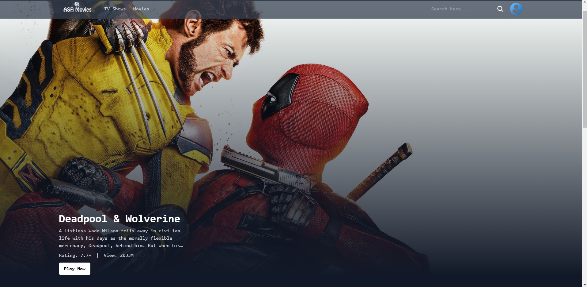

# Movie Search App

A simple movie search application that allows users to search for movies, view details, and discover information like titles, overviews, release dates, and more. The app fetches data from the [The Movie Database (TMDb) API](https://www.themoviedb.org/).

## Screenshot



## Features

- Search for movies by title
- View movie details like release date, overview, and poster images, cast
- Get Trending, Top Rated Movies and Top Rated TV Shows
- Discover all Movies and TV Shows
- Able to play trailers directly from movie or tv show details page
- Responsive design for seamless user experience across devices

## API Used

The Movie Database (TMDb) API is used to fetch movie data. The following API endpoint is used to search for movies:

- **API Endpoint**: `https://api.themoviedb.org/3/search/movie`
  - **GET Method**: `GET /search/movie`
  - **GET Method Trending Movies**: `GET /trending/all/{time_window}`
  - **GET Method Credits**: `GET /tv/{series_id}/credits`
  - **GET Method Top Rated**: `GET /movie/top_rated`
  - **Parameters**:
    - `api_key`: Your TMDb API key (must be kept secret)
    - `query`: The search query `location?.search?.slice(3)`
    - `page`: Page number for pagination (default is 1)

## Dependencies

This project uses the following dependencies:

- `react Vite`: Vite is a build tool that aims to provide a faster and leaner development experience for modern web projects
- `react-dom`: The entry point for React DOM
- `redux`: Predictable state container for JavaScript apps
- `react-redux`: Official React bindings for Redux
- `tailwindcss`: A utility-first CSS framework for creating custom designs
- `axios`: Promise-based HTTP client for the browser and Node.js
- `react-router-dom`: Declarative routing for React applications
- `dotenv`: Module to load environment variables from a `.env` file
- `momentjs`: Parse, validate, manipulate, and display dates and times in JavaScript.

## Installation

1. Install the dependencies:
   ```bash
   npm install react react-dom axios react-router-dom dotenv momentjs redux react-redux @reduxjs/toolkit
   ```
2. Installing tailwind css
   ```bash
   npm install -D tailwindcss postcss autoprefixer
   npx tailwindcss init -p
   ```
3. Created a `.env` file in the root directory and added TMDb API key:

   ```env
   VITE_ACCESS_TOKEN= <Api key>
   ```

4. Run the app:
   ```bash
   npm run dev
   ```

The app available at `https://ash-movie-search.netlify.app`.

## Acknowledgements

- [The Movie Database (TMDb) API](https://www.themoviedb.org/)
